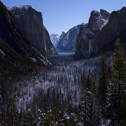

# Homework 1 (Color-Transfer and Texture-Transfer)

We organize this report as follow:
1. Training CycleGan
    - describe some modification we made (`deconv` vs. `upsample + conv`)
    - shoing the training loss plot
2. Inferencing
    - visualize/analysis the difference before/after the modification
    - Visualization with different input resolution
    - Show some result on personal images
3. Other method [TODO]

## 1. Training CycleGan
We train CycleGan on `summer2winter_yosemite` dataset. The training detailed and modification we made are summarized as follow:
- We use batch size 8 and input resolution `128x128` to fit our time space constraint.
- All the other hyperparamters are same as original placeholder.
- We tried original `Deconv` and `Upsample + Conv`. Detailed discussion and comparison later.
- We use tensorboardX to monitor the training (see below figures)
    - | Discriminator A | Discriminator B | Generator |
      | :--: | :--: | :--: |
      |  |  |  |

## 2. Inferencing
One of the visual defect of original cycle gan is chekerboard artifacts [[ref]](https://distill.pub/2016/deconv-checkerboard/). The reference propose to use `upsample` followed by a `conv` to alleviate the artifact. We tried both `deconv` and `upsample + conv` and showing some of the result as follow:

| Input (winter) | `deconv` CycleGan | `upsample + conv` CycleGan |
| :---: | :------: | :---------------: |
|  |  |  |
|  |  |  |
|  |  |  |
|  |  |  |
|  |  |  |

| Input (summer) | `deconv` CycleGan | `upsample + conv` CycleGan |
| :---: | :------: | :---------------: |
|  |  |  |
|  |  |  |
|  |  |  |
|  |  |  |
|  |  |  |

From above figures, we observe the `deconv` indeed results more checkerboard artifact than `upsample + conv` does. To further prove the idea, we performe a frequency domain analysis by inspecting the spectrum of 2d discrete fourier transform. We take the mean of all spectrum from normal images, images generated from `deconv` CycleGan and `upsample + conv` CycleGan respectively. Below figures show the mean spectrum of each:

| Normal images | `deconv` CycleGan | `upsample + conv` CycleGan |
| :-----------: | :---------------: | :------------------------: |
|  |  |  |

The mean spectrum of normal images is smooth with one spotlight in the middle as expected. The spectrum of `deconv` have a grid arange spotlights in high frequency area which could cause by the so called checkerboard artifacts. Though there is less checkerboard in `upsample + conv`, the spectrum of it have valley in high frequency.

In sum, although the two trained CycleGans are able to transform the style, the artifact are easy to observe if we look detailly.

Below figure showing some result on our captured images by `upsample + conv` CycleGan.

| Scene | Input | to winter | to summer |
| :---: | :---: | :-------: | :-------: |
| 房間窗外 |  |  |  |
| 沖繩水族館 |  |  |  |
| 金瓜石 |  |  |  |
